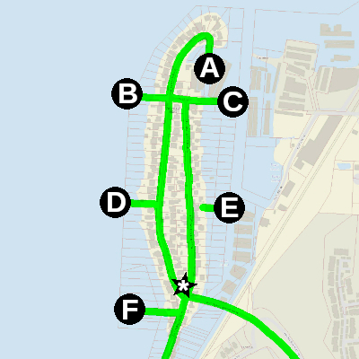

**Objective: Adopt the public spaces on Day Island as a walkable network of micro-parks.**

## Current State

Day Island delineates the University Place shoreline from the north. The island and its shoreline is primarily made up of private residential property, but there is some right-of-way on the island that allows public access to the roads and a handful of shoreline access points. Many of these public access sites can be hard to find because they are not clearly marked and houses are tightly packed around them. The best way to explore these public spaces is on foot. It's ~1 mile total walk to check out every site marked below.

* Site `A`
    * Not a lot to see here currently, other than the backside of several houses and the marina. The gate and steps down seem well maintained.
    * [*See on Google Maps*](https://maps.app.goo.gl/ezszHzK3WEuPjn9J9)
* Site `B`
    * In its current state, this site already acts as a public beach with great views and receives regular visitors. The trail to the beach is sometimes overgrown.
    * [*See on Google Maps*](https://maps.app.goo.gl/k9PbHazJ4ahj4cjz5)
* Site `C`
    * This is the most hostile public site on the island. You would have to climb down from the road to get to the shore. Not a lot to see here currently.
    * [*See on Google Maps*](https://maps.app.goo.gl/42ymebz9vVEMUQAW6)
* Site `D`
    * In its current state, this site already acts as a public beach with great views and receives regular visitors. The trail to the beach is sometimes overgrown. Someone has setup a nice sitting area above the beach with a bench.
    * [*See on Google Maps*](https://maps.app.goo.gl/i8uEf5TVYBKg67bV7)
* Site `E`
    * This site is behind the Day Island Club House. It's not a usable public space currently. It could use some landscaping to make the incline more traversable and address blackberries sticking out everywhere. The view is nice from this site and would be a prime candidate for public lagoon access once the issues are addressed.
    * [*See on Google Maps*](https://maps.app.goo.gl/yuHdAP8JWHjQyJRh6)
* Site `F`
    * This is the easiest shore access to find on the island, but the boundaries are not clearly marked. There is no great path to get from the road onto the beach, but you can carefully step over some rocks to get there.
    * [*See on Google Maps*](https://maps.app.goo.gl/ALU5aNjUPkUUYaEd9)
* Site `*`
    * This site is marked with an asterisk because it is the only inland public space on the island. It currently acts as a park with a small lawn and picnic table under a tree that provides shade. It's also the first public space to welcome you onto the island.
    * [*See on Google Maps*](https://maps.app.goo.gl/EUDNTjVtUio19J4P9)

## Proposal

The UP Shoreline Public Access Coalition proposes that the City of University Place adopt the public spaces on Day Island as a walkable network of micro-parks. We strongly advocate for sites marked above as `B`, `D`, `E`, `F`, and `*` to be included. The other sites, `A` and `C`, we recognize have less to offer without significant intervention and advocate they be considered as a stretch goal for future inclusion into the network. The walking path between each micro-park would be the existing road as-is.

### Envisioned Benefits

1. Re-zoning these spaces as Parks and Open Spaces (POS) will help ensure these spaces remain public for future generations.
1. Adoption of these spaces by University Place Parks Department will provide reliable maintenance, accessibility, and discover-ability.
1. Clear and consistent signage to define island boundaries.
1. Public garbage bins to help control litter.
1. Organizations like the [South Sound Surfriders](https://southsound.surfrider.org/) are more likely to provide environmental and safety volunteer support to a recognized park.
1. More parks makes UP a better place to live.

### Nuances

1. The board of the Day Island Club should be close partners on this project, especially because their club house is on one of the public sites.
1. Public parking is limited on the island.
    * ~0.7 mile walk from nearest bus stop to the island with no connecting sidewalk.
    * There is a medium sized private parking lot on the island for the Day Island Yacht Harbor near Site `B`, perhaps we could collaborate with them to provide a few accessible parking spots to the public?
    * There is also plenty of room at Site `F` to add a public accessible parking space.

### Alternative

If the city is unable to adopt this proposal, then we must rely on volunteer efforts to maintain the spaces. We can take inspiration from [Friends of Street Ends](https://www.streetends.org/) in Seattle who use volunteers to transform and maintain shoreline access right-of-ways. The main downsides of this alternative are (1) volunteer maintenance can be unreliable and (2) less accountability to meet a shared city-wide vision for the spaces.
