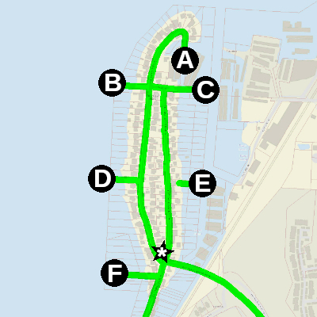

**Objective: Adopt the public spaces on Day Island as a walkable network of micro-parks.**

## Current Status

After sharing the initial proposal w/ UP Parks Advisory Commission ([see update](#2026-03-12)), we are planning to focus on spreading awareness and encouraging usage of the public spaces on Day Island throughout Summer 2026. This will involve making [flyers](/visit-day-island), social media posts, in-person networking, and organizing [public events](/get-involved) on the island.  We will aim to document all this and share the results with the city at the end of the summer.

Our coalition will also be involved in community engagement for the [Day Island Sewer System Replacement](https://www.piercecountywa.gov/7899/Day-Island-Sewer-System-Replacement) to see if there are any wins for public access that can be considered in this county project. We gave public comment to the city council about this on [2026-04-06](#2026-04-06).

## Background

Day Island delineates the University Place shoreline from the north. The island and its shoreline are primarily made up of private residential property, but there is some right-of-way on the island that allows public access to the roads and a handful of shoreline access points. Many of these public access sites can be hard to find because they are not clearly marked and houses are tightly packed around them. The best way to explore these public spaces is on foot. It's ~1 mile total walk to check out every site marked below.

*[Google Maps](https://maps.app.goo.gl/VMtUWb1bGhitF3dE8)*

* Site `A`
    * Not a lot to see here currently, other than the backside of several houses and the marina. The gate and steps down seem well maintained.
* Site `B`
    * In its current state, this site already acts as a public beach with great views and receives regular visitors. The trail to the beach is sometimes overgrown.
* Site `C`
    * This is the most hostile public site on the island. You would have to climb down from the road to get to the shore. Not a lot to see here currently.
* Site `D`
    * In its current state, this site already acts as a public beach with great views and receives regular visitors. The trail to the beach is sometimes overgrown. Someone has setup a nice sitting area above the beach with a bench.
* Site `E`
    * This site is behind the Day Island Club House. It's not a usable public space currently. It could use some landscaping to make the incline more traversable and address blackberries sticking out everywhere. The view is nice from this site and would be a prime candidate for public lagoon access once the issues are addressed.
* Site `F`
    * This is the easiest shore access to find on the island, but the boundaries are not clearly marked. There is no great path to get from the road onto the beach, but you can carefully step over some rocks to get there.
* Site `*`
    * This site is marked with an asterisk because it is the only inland public space on the island. It currently acts as a park with a small lawn and picnic table under a tree that provides shade. It's also the first public space to welcome you onto the island.

## Proposal

The UP Shoreline Public Access Coalition proposes that the City of University Place adopt the public spaces on Day Island as a walkable network of micro-parks. We strongly advocate for sites marked above as `B`, `D`, `E`, `F`, and `*` to be included. The other sites, `A` and `C`, we recognize have less to offer without significant intervention and advocate they be considered as a stretch goal for future inclusion into the network. The walking path between each micro-park would be the existing road (upcoming potential road improvements from [Day Island Sewer System Replacement](https://www.piercecountywa.gov/7899/Day-Island-Sewer-System-Replacement)).

The city should view Market Square (aka Village Square, in front of the library) as precedent for investing in non-road city right-of-way as park-like spaces. The city currently maintains garbage cans, drinking fountains, bike racks, seating, vegetation, art, and events in Market Square. It may not be a 1 to 1 translation, but the city should be considering how they can add similar value to non-road right-of-way spaces on Day Island for the public.

### Envisioned Benefits

1. Investment in these public spaces by the city will help them remain public for future generations.
1. The city can provide reliable maintenance, accessibility, and discover-ability.
1. Clear and consistent signage to define island boundaries.
1. Public garbage bins to help control litter.
1. Bike racks to reduce vehicle congestion on island.
1. Organizations like the [South Sound Surfriders](https://southsound.surfrider.org/) are more likely to provide environmental and safety volunteer support to a recognized park.
1. Shoreline attractions draw people to UP.
1. More eyes and ears along the UP shoreline make it a safer place.
1. Mark public shoreline for passing small watercraft (appeal to be included in the [Cascadia Marine Trail](https://www.wwta.org/water-trails/cascadia-marine-trail/)).

### Nuances

1. The board of the Day Island Club should be close partners on this project, especially because their club house is on one of the public sites.
1. Public parking is limited on the island, treated like neighborhood parking.
    * ~0.7 mile walk from nearest bus stop to the island with no connecting sidewalk.

## Updates

### 2026-04-06

Gordon McCreary (UP Shoreline Public Access Coalition Leader) made a public comment at the University Place city council meeting. This public comment was meant to do 3 main things:
1. Call to action for city council to be involved in the [Day Island Sewer System Replacement project](https://www.piercecountywa.gov/7899/Day-Island-Sewer-System-Replacement) while considering the future of public access.
1. Formally introduce the city council to our coalition.
1. Raise awareness about this proposal.

Watch playback (starting at 44m 40s):
https://www.youtube.com/live/AJv1Zb9cdWs?t=2680

Public comment does not allow for discussion, so we have to hope our message was heard. Prior to the meeting starting, city council member #4 Edward Wood introduced himself to Gordon and they got to briefly discuss the topic. Council member Wood sounded responsive to the proposal, specifically calling out how inconvenient it can be trying to get down to the water when you live well inland.

Present city council members:
* #1 Javier Figueroa
* #2 Frank Boykin
* #3 Alecia Cunningham
* #4 Edward Wood
* #5 Denise McCluskey (Mayor Pro Tem)
* #7 Melanie Grassi

Absent city council members:
* #6 Stan Flemming (Mayor)

### 2026-03-18

Gordon McCreary (UP Shoreline Public Access Coalition Leader) met with Jordan Martin (UP Senior Project Engineer) at the City of University Place Planning Department to clarify public parking on Day Island. Jordan said to treat it the same as parking in any public neighborhood: don't park too close to corners, don't block driveways, and try to get on the shoulder as much as possible.

Jordan also shared an interesting insight that some of the sewer lines for the island exist under the shoreline and are not always accessible due to tide changes and rising sea levels. For this reason, they will eventually relocate the sewer lines under the main roads on the island where they can also improve the roads at the same time (better shoulders and pedestrian safety). Our coalition will be staying involved in this project to be a voice of public access: https://www.piercecountywa.gov/7899/Day-Island-Sewer-System-Replacement

### 2026-03-12

We met with the University Place Park Advisory Commission during their scheduled meeting ([see agenda](https://cityofup.com/AgendaCenter/ViewFile/Agenda/_03122026-506?html=true)), where we reviewed the original Day Island Micro-Park Network proposal (allocated as "Shoreline Access Improvements on Day Island" on the meeting agenda).

Attendees:
* Gordon McCreary (UP Shoreline Public Access Coalition Leader)
* Amy Wolfe (UP Park Advisory Commission Chair)
* Katy Schaff (UP Park Advisory Commissioner)
* Kristi Jones (UP Park Advisory Commissioner)
* Nora Flemming de Sandoval (UP Park Advisory Commissioner)
* Tony West (UP Operations Manager)
* Jack Ecklund (UP Director of Public Works)

No opposition to the intentions of the proposal were raised, but there was a broad anticipation that some Day Island residents would oppose raising awareness of public spaces on the island. Jack Ecklund was able to provide some legal insights that will require updating our proposal: (1) there is no legal pathway for re-zoning right-of-way as a park and (2) public volunteers don't have the right to maintain these spaces. On a more positive side, Jack was also able to provide Market Square as an existing example within UP where right-of-way is maintained by the city to be used as a public space (seating, trash cans, events, art, etc). So there may not be a path currently to have the city formally re-zone and adopt these as parks, but there is precedent to have the city invest in and encourage use of such right-of-ways.

Nora Flemming de Sandoval suggested, before we petition or bring this to city council, we (1) continue to build out this coalition to act as a voice of the public that will counter any voices of resistance from Day Island residents and (2) spread awareness about and normalize usage of the public spaces on Day Island in their current state to show that they are worth investing in.
