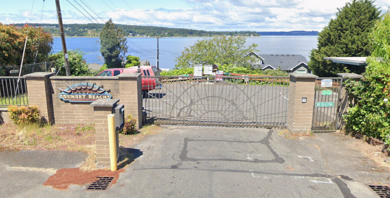

**Objective: Realize Patrician Lane on Sunset Beach as a shoreline park.**

## Background

If you've ever attempted to visit Sunset Beach, you may have been faced with this unfortunate sight:

Our coalition believes this is a scare tactic, because Sunset Beach is not completely private. As you can see in the map below, the public right-of-way (ROW) that this gate terminates actually continues on the other side of the tracks. The public is completely within their rights to be present on Sunset Beach within the bounds of the public right-of-way. It might be hard to see from the map below, but the strip of walkway on the north-west side of the tracks that connects all the houses on Sunset Beach is also public right-of-way.

Our coalition is still trying to figure out if the public has the right to cross the railroad ROW. There are actually 4 railroad crossings at this site (`085745Y`, `085746F`, `085747M`, & `085748U`), all of which are inventoried as private crossings with public access. The "private crossing" just means the crossing isn't maintained by a public authority, and we think "with public access" *probably* means the general public are allowed to use the crossing since it is public property on either side (we will update this page if we can get confirmation). Assuming the crossing is truly public access, then that gate is a big problem for accessibility. Of course, you can always access the public right-of-way by sea.

From visiting the site, you will see that neighbors have encroached on the public right-of-way by building boat storage and fences in the public space.

## Proposal

There is a Sunset Beach plat that the Pierce County auditor filed in 1933 that labels the public right-of-way leading out into the water as "Patrician Lane", and says:

> ...the owner of the following described reef property...hereby donate and dedicate the lane and roads shown thereon to the public forever, for street and park purposes...

The UP Shoreline Public Access Coalition proposes that the city of University Place realize the portion of Patrician Lane on Sunset Beach as a park. The city should declare intent to utilize this public space as part of their parks and trails network. This would enable the city to coordinate with all the key stakeholders to ensure a safe and accessible rail crossing. A declaration of intent would also enable the city to give notice to Sunset Beach residents to move their things off the public right-of-way.

As usual, we would like to see essential amenities at this park:
* Trash cans
* Bike rack
* Accessible parking
* Drinking Fountain
* Restroom

And clear signage to ensure private and public property boundaries are being respected.
